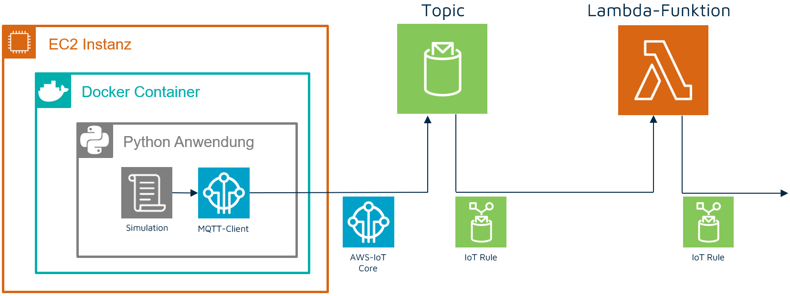
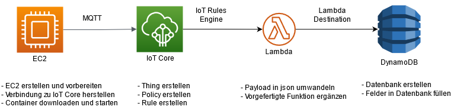

# BPA-factory-integration-and-simulation
# Quick Start

> Für die genaue Vorgehensweise und ausführliche Erläuterungen empfiehlt sich das Anschauen der Praktikumsvideos am Ende dieser README.
## Server vorbereiten
**Voraussetzungen:** Docker, docker-compose, git und Port 8883 geöffnet 

1. Repository klonen: `git clone https://github.com/Donat24/BPA-factory-integration-and-simulation.git`
2. IoT-Topic in Datei für Umgebungsvariablen `.env` anpassen.

## Verbindung Field Device und AWS
1. IoT Thing in AWS erstellen
2. Thing Zertifikate erstellen und herunterladen
3. Gewünschtes Topic in IoT Thing Policy zulassen
4. Kopieren der Zertifikate in den Ordner `aws-certs` auf gleicher Ebene des Repositories

## Payload mit Lambda Function umwandeln
1. Lambda Funcion mit dem Code aus [2.6 Lambda Function Payload Umwandlung](#2-6-lambda-function-payload-umwandlung) erstellen.
2. IoT Rule als Trigger für Lambda hinzufügen
3. IoT Rule erstellen, die alle Nachrichten des gewählten Topics entgegen nimmt und weiterleitet: `SELECT * FROM "bpa/sxxxx`

## Field Device starten
1. Docker Compose Services vorbereiten: `docker-compose build`
2. Docker Compose Services starten: `docker-compose up (-d for detached)`

> Nun werden alle einkommenden Nachrichten umgewandelt und können von der Lambda Function an weitere AWS Services weitergeleitet werden.

# 1. Einführung
## Zielstellung
Zielstellung des Projektes ist die visuelle Darstellung der Overall Equipment Effectiveness (OEE) von Maschinen durch Anwendung von Services in AWS. Dafür wurde der Kurs in drei Gruppen unterteilt, wobei jede Gruppe einen separate Unteraufgabe der Zielstellung bearbeitet. Die einzelnen Themen sind:
1. Factory Integration & Simulation
2. Data Processing & Analytics
3. UI & external Connectors

Konkret soll Gruppe 1 Field Devices simulieren und die Nachrichten dieser zur weiterern Verarbeitung in AWS verfügbar machen. Gruppe 2 soll diese Nachrichten verarbeiten, die zur Berechnung der OEE nötigen Werte aggregieren und in einer konsumierbaren Form für Gruppe 3 bereitstellen. Gruppe 3 hat die Aufgabe den Verlauf der OEE und gegebenenfalls weitere Kennzahlen visuell darzustellen und gleichzeitig für einen externen Zugang zu sorgen.

Team 1 und Ersteller dieser Dokumentation sind [Tamás Janusko](https://github.com/TamasJ), [Jonas Kretzschmar](https://github.com/Donat24), [Patrick Pietsch](https://github.com/patudd) und [Max Schwerdtner](https://github.com/mschwrdtnr).

# 2. Architekturkonzept und Schnittstellen
## 2.1 Grobüberblick Architektur

Hauptaufgabe der Gruppe ist es eine Maschine zu simulieren und dessen Daten innerhalb von AWS verarbeitbar zu machen. Für die Simulation der Maschine wird der Service "EC2" von AWS verwendet. Dieser stellt proportionierbare Serverkapazitäten bereit und bietet sich deshalb für die Ausführung von Programmen an. Alternativ wurde die Simulation einer Abfüllanlage mittels Node-RED in Betracht gezogen. Um möglichst wenig Aufwand bei der Ausführung der Simulation zu haben, wird ein Docker-Container verwendet, der allen nötigen Programmcode enthält. Durch die Containerisierung ist es theoretisch möglich mehrere Maschinen gleichzeitig zu simulieren und mit AWS zu verbinden.

Die Simulation auf der EC2 leitet mittels des MQTT-Protokolls Nachrichten an IoT Core weiter. Die Nachrichten bestehen dabei aus einem in hexadezimal umgewandelten Payload, um im Realfall oder bei der Nutzung des Funkstandards LoRaWAN sparsam bei der Datenübertragung zu sein. Dieser Schritt dient zur Übung und Bekanntmachung mit LoRaWAN und ist nicht zwingend notwendig. Innerhalb des Services IoT Core ist eine IoT Rule definiert mit welcher alle eingehenden Nachrichten eines bestimmten Topics weitergeleitet werden können. Unter anderem lassen sich die Nachrichten an IoT-Analytics, eine DynamoDB oder AWS Kinesis weiterleiten, um die Nachrichten zu speichern oder weiter zu verarbeiten. Im vorliegenden Fall werden alle Nachrichten an eine Lambdafunktion weiterleitet. Die Lambda-Funktion erhält die Nachricht der Maschine über die definierte IoT Rule, wandelt diese in eine einfacher verarbeitbare JSON-Nachricht um und leitet die umgewandelte Nachricht an eine Lambda-Funktion von Gruppe 2. 

Der gesamte Architekturaufbau ist in der nachfolgenden Abbildung dargestellt.


## 2.2 Field Device Funktionsweise
Die simulierte Maschine ist eine Getränkeabfüllanlage. Diese wird mithilfe eines Python Skripts simuliert. Die Containerisierung ermöglicht die einfache Verwendung der Simulation auf anderen Servern und soll gleichzeitig dafür sorgen, dass mehrere Simulationen auf einem oder mehreren Servern durchgeführt werden können.

Um eine sinnvolle OEE zu berechnen, hat die Maschine eine Planbelegungszeit und Planmenge hinterlegt. Die Maschine sendet Informationen über die Abfüllung neuer Flaschen, der Aussortierung von Flaschen und dem Stop der Maschine. Aufgrund zufälliger Ereignisse kommt es gelegentlich zu Ausfällen oder zur Aussortierung von Flaschen, was zu einer geringeren Menge produzierter Flaschen sorgt.

Zur besseren Wartbarkeit der Anwendung, für Debugging-Zwecke aber auch für das einfache parallele Nutzten mehrerer Container werden verschiedene Variablen und Parameter der Anwendung aus den Umgebngsvariablen des Docker-Container geladen. Diese Variablen können dem Docker-Container für eine entsprechende Anpassung beim Starten einfach mitgegeben werden. Idealerweise geschieht dies über das  environment file (.env), welches für dieses Projekt bereits vorhand ist und in das docker-compose file bereits eingebunden wurde. 

| Umgebungsvariable | Bedeutung | Standardwert |
|---|---|---|
| AWS_HOST | AWS IoT Core MQTT Host | - |
| IOT_TOPIC | Das Topic, auf den die Nachrichten publisched werden | topic_1 |
| IOT_CLIENT_ID | IoT Client ID / Publisher der Nachrichten | machine_1 |
| TIME_FACTOR | Verhältniss von Echtzeit zu Simulationszeit | 1 |
| DEBUG | Ermöglicht das Ändern des Simulationsstartes auf einen anderen Wert durch den Parameter START_DATE_TIME | 0 |
| START_DATE_TIME | Startzeitpunkt der Simulation. Funktioniert nur wenn Debuging aktiviert ist | "2021-05-03T11:11:45.1345" |

**Wichtig:** Alle Umgebungsvariablen mit Ausnahme von AWS_HOST sind optional. AWS_HOST hingegen ist verpflichtend anzugeben!

> Weitere Informationen zum Environment-File und Umgebungsvariablen in Docker: https://docs.docker.com/compose/environment-variables/

### Datenmodell des Field Device 
Während der Simulation enstehen verschiedene Ereignisse. Diese werden im json-Format mithilfe von MQTT gesendet. Der Aufbau einer Nachricht sei wie folgt definiert:

| Attribut | Möglicher Wert | Erläuterung |
|---|---|---|
| timestamp | 32-bit-Integer Zahl | Aktuelle Uhrzeit als Unixzeit |
| machine | int: 1-255 | Nummer der Maschine zur Unterscheidung verschiedener Maschinen |
| message_type | int: 1 - 3 | Dient zur Unterscheidung der Nachrichten:<br>1: Information<br>2: Warnung<br>3: Fehler |
| message | int: 1 - 255 | Der Nachrichtentyp ist ausschlagebend für die Nachricht:<br>**1-Information:**<br>- 1: Maschine gestartet<br>- 2: Maschine gestoppt<br>- 3: Wartung gestartet<br>- 4: Wartung beendet<br>- 5: Flasche abgefüllt<br>**2-Warnung:**<br>- 1: Keine Flaschen vorhanden<br>- 2: Flasche aussortiert<br>**3-Fehler:**<br>- 1: Unerwartete Störung |

Auf Basis dieser Definition sieht eine Nachricht beispielsweise wie folgt aus:

```json
{
   "timestamp": "1622054915732",
   "machine": 1,
   "message_type": 1,
   "message": 1
}
```

Diese Nachricht wird innerhalb der Simulation in einen Hexadezimal-Wert umgewandelt.

### Erläuterung Umwandlung Payload

Bei den Payload handelt es sich um Nachrichtenpakete zwischen Sensor bzw. Maschine. Diese beinhalten keine Steuer- und Protokollinformationen, sondern nur die zu übertragenen Nutzdaten.

Um den Umfang der zu übertragenen Datenmengen gering zu halten, werden diese kodiert, wodurch Energie eingespart werden kann. Beispielsweise kommt bei LoRaWAN hinzu, dass für die Übertragung des Payloads öffentliche Frequenzkanälen genutzt werden und die Datenmenge, welche pro Tag übertragen werden kann, gesetzlich begrenzt ist.

Für den Aufbau des Payloades gibt es keine festen Vorgaben. Es ist üblich die Messwerte am Sensor zu erfassen und die gesammelte Informationen auf ein einheitliches Datenformat zu bringen und geschlossen zu übertragen. Diese Werte werden Byteweise in ein Array gespeichert und Protokollabhängig verschlüsselt übertragen.

In einem Byte können acht Bit gespeichert werden, welche Null oder Eins sein können, weshalb sich daraus Zustände von 2^8 also 256, ergeben. Der Payload selber wird als hexadezimal übertragen, was somit Formate zwischen 00 und FF für 255 ermöglicht. Nach dem im Projekt festgelegten Datenschema können somit maximal 255 verschiedene Maschinen, Nachrichten-Typen oder Nachrichten-Codes übertragen werden.

Bei der Abfüllanlage wird ebenfalls der Unix-Timestamp übertragen. Mit 4 Bytes lassen sich mit 256 hoch 4 (256⁴) circa 4 Milliarden Zustände abbilden und somit auch der Timestamp mit weniger als 2 Mrd Werten. Durch Shifting, wird durch Arithmetik die Ausgangsvariable, in dem Fall der Integer-Wert des Timestamps, auf das einzelne Byte-Array verteilt und wie beschrieben in einen Hexadezimal-Wert umgewandelt.

Entsprechend der Entwicklerdefinition, wird der eingehende Payload durch den Decoder, wieder in die ursprünglichen Teile zerlegt und anschließend, beispielsweise als JSON-Objekt, nachstehenden Systemen bereitgestellt.

## 2.3 Schnittstelle EC2 und IoT Core
Ein in der IoT-Welt typischen Ansatz zur Datenübermittlung ist das sogenannte Publish-Subscribe-Pattern, welches bspw. vom MQTT Protokoll implementiert wird. Dabei werden Nachrichten von einem Publisher (z.B. ein IoT Gerät) mit einem sogenanntes Topic versehen. Diese Topics können von Subscribern abonniert werden. Wird eine Nachricht mit einem bestimmten Topic verschickt, so erhalten alle Subscriber des Topics die entsprechende Nachricht und können diese auswerten. Im Fall von MQTT exisitiert einen Mittelsmann zwischen Publischer und Susbriber, welcher Broker gennant wird und das Zustellen und Verwalten der Nachrichten von den Pubilshern zu den Subscribern übernimmt.

> Weitere Informatioen zum Thema MQTT: https://docs.aws.amazon.com/de_de/iot/latest/developerguide/mqtt.html

AWS IoT Core basiert grunsätzlich auf MQTT 3.1.1. Anzumerken dabei ist, dass AWS IoT anstelle vom "klassischen" Subscriben eines Topics sogenannte IoT Rules verwendet, welche das Verhalten bei eingehenden Nachrichten definieren (etwa das Weiterleiten der Nachricht an eine Lambda Funktion). Ferner läuft der Broker auch direkt in der AWS IoT Cloud, der Entiwckler kommt mit diesen nicht direkt in Kontakt. Somit werden hier durch das Field Device Nachrichten unmittelbar in die AWS-Cloud und damit einhergehende IoT-Ökosystem eingespeist. 

> Damit in AWS IoT Core für ein IoT Gerät verwendet werden kann, ist der nachfolgende Schritt zu beachten.

## 2.4 IoT Core: Where the IoT magic happens
AWS IoT ermöglicht das Verbinden von IoT Geräten mit der AWS Cloud und folglich das Nutzten diverser anderer Dienste im Zusammenhang mit diesen Geräten oder den von den Geräten übermittelten Daten. Auf der offiziellen Webseite von AWS IoT wird davon gesprochen, das mithilfe von diesem Dienst IoT Geräte in "AWS IoT-based solutions" integriert werden können.

> Weitere Information zu diesem Thema unter: https://docs.aws.amazon.com/iot/latest/developerguide/what-is-aws-iot.html

Um die simulierten Daten zu erfassen, wird in AWS IoT Core hierzu ein neues Thing angelegt welches im AWS-Ökosystem die Schnittstelle zur Maschine darstellt. Ein Thing ist hierbei eine Repräsentation des Field Devices in IoT Core. Die zugehörigen Zertifikate werden nun beschafft und es wird zudem eine Policy hinzugefügt, in der erlaubte Operationen (Publish/Subsribe/...) und zugehörige Topics/Client IDs definiert werden. Zur Kommunikation mit dem simulierten Endgerät wird sich der Python Bibliothek AWSIoTPythonSDK bedient, mit der ein Client die Verbindung mit IoT Core erstellt und entsprechend der Policy konfiguriert werden kann.

> Ausführliche Dokumentation: https://aws.amazon.com/de/iot-core/

## 2.5 IoT Rules Engine: Schnittstelle IoT Core und Lambda Function
Die IoT Rules Engine ermöglicht es innerhalb von IoT Core Topics zu abonnieren und bei Nachrichteneingängen selbst definierte Ereignisse auszulösen. Dabei kann mittels SQL bei Erhalt einer Nachricht eine bestimmte Aktion mit den gewünschten Attributen der Nachricht definiert werden. Beispielsweise kann der komplette Inhalt der Nachricht in eine Datenbank geschrieben werden, bei einem bestimmten Nachrichteninhalt ein Alarm ausgelöst werden oder die Nachricht an eine Lambda Funktion weitergeleitet werden.

Im vorliegenden Fall wird die komplette Nachricht an eine Lambda-Funktion übergeben. Dafür wird innerhalb der IoT-Rule der Befehl `SELECT * FROM "bpa/sxxxx"` verwendet. 

> Ausführliche Dokumentation: https://docs.aws.amazon.com/iot/latest/developerguide/iot-rules.html
## 2.6 Lambda Function: Payload-Umwandlung

Eine AWS Lambda Function stellt Rechenleistung in der Cloud bereit ohne Schritte zur Server-Verwaltung, Skalierung oder Load Balancing zu erfordern. Es reicht aus den auszuführenden Code einzupflegen. 

Die Weiterverarbeitung der vom Field Device gesendeten Daten findet mithilfe einer solchen Lambda Function statt. Beim Anlegen wird Node.js 14x als Laufzeitumgebung gewählt.

Der eingehende Payload muss als erstes von Hexadezimal wieder in ein Byte-Array umgewandelt werden. Dies passiert mithilfe der Funktion *Buffer.from()*. Anschließend wird der Decoder aufgerufen, welche das JSON mit den übergebenen Messwerten füllt. Das Loggen des Aufrufs, sowie die Ausgabe des Objektes, findet durch die Funktion *console.log()* statt, welche im Produktivsystem auch entfernt werden sollte.

Folgender Programmcode ist für die Funktion notwendig:

```js
exports.handler = async (event) => {
    
    const buf = Buffer.from(event, 'hex');
    var response = DecodeMsg(buf);
    
    console.log("Response \n");
    console.log(response);
    
    return response;
};

function DecodeMsg(bytes) {
   var machine = bytes[0];
   var message_type = bytes[1];
   var message = bytes[2];
   var timestamp = (bytes[3] << 24 | bytes[4] << 16 || bytes[5] << 8 | bytes[6] );
    
   var iot_bottle_msg = {
      "machine": machine,
      "message_type" : message_type,
      "message" : message,
      "timestamp" : timestamp,
    };
    
    return {
      iot_bottle_msg
    }
}
```

> TODO: Kurzer Satz zur Weiterleitung an Gruppe 2.

> Ausführliche Dokumentation: https://aws.amazon.com/de/lambda/

# 3. Praktikumsvorstellung und Präsentation
## 3.1 Durchführung des Praktikums
Ziel des Praktikums war es die Kommilitonen den gesamten Prozess der Projektgruppe selber entwickeln zu lassen, um die gemachten Erfahrungen und das entstandene Wissen weiterzugeben und voneinander zu lernen. Die Durchführung erfolgte durch Erstellung einzelner Videos mit gleichzeitigem Support bei aufgetretenen Problemen. Die Videos wurden nach den jeweiligen einzelnen Technologien getrennt. Der Ablauf des Praktikums ist in der nachfolgenden Abbildung dargestellt:


Im Gegensatz zur dargelegten Projektarchitektur wurde im Praktikum die umgewandelte Nachricht nicht an eine weitere Lambda Function weitergeleitet sondern in eine DynamoDB geschrieben.


Nachfolgend finden sich die Links zu den einzelnen Videos:
1. [Einführung und Erläuterung der folgenden Praktikumsteile](https://web.microsoftstream.com/video/30dedeb7-04d3-4684-a1e8-7b253da17a6e)
2. [Erstellung und Vorbereitung einer EC2](https://web.microsoftstream.com/video/33d32d26-1932-4fc1-9751-2445623f9236)
3. [Erstellung eines IoT Things](https://web.microsoftstream.com/video/3106a24b-f3c3-4167-b715-5709f9ab8607)
4. [Erläuterung des MQTT Client Setups und der Verbindung zu AWS IoT Core](https://web.microsoftstream.com/video/3aa2df7a-a204-4294-97d5-528f3b56e0bc)
5. [Umwandlung des Payload innerhalb einer Lambda Function](https://web.microsoftstream.com/video/1e73c3f4-6cc8-4973-91e4-90e4becfacb7)
6. [Speicherung der Nachrichten in eine DynamoDB](https://web.microsoftstream.com/video/85c058ea-2fc8-497f-80f1-cb41c42d5f86)


> **Information:** Die Videos sind hochschulintern und damit nicht öffentlich. Wenden Sie sich bei Bedarf an einen der Contributor.

## 3.2 Präsentation der Projektergebnisse
Im Rahmen des Moduls wurden die Ergebnissen innerhalb von 10 Minuten allen Kommilitonen, dem Professor, sowie Interessenten vorgestellt. Die dazugehörige Präsentation lässt sich dem Ordner [docs/](docs/BPA_Grp1_Abschluss.pdf) entnehmen.
