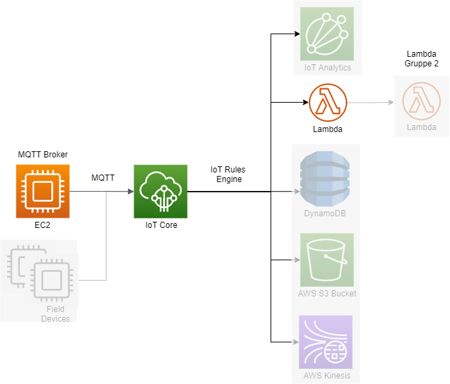

# BPA-factory-integration-and-simulation

> TODOS und Aufbau sind in [Issue #7 beschrieben](https://github.com/Donat24/BPA-factory-integration-and-simulation/issues/7)

# Quick Start
## Field Device
**Voraussetzungen:** Docker, docker-compose und git

1. Clone the repository: `git clone https://github.com/Donat24/BPA-factory-integration-and-simulation.git`
2. Docker Compose vorbereiten: `docker-compose build`
3. Docker Compose starten: `docker-compose up (-d for detached)`

## Verbindung AWS und IoT Core
Siehe Praktikumsvideos..

## Verwendung Lambda Function
Siehe Praktikumsvideos..

# 1. Einführung
## Zielstellung
Zielstellung des Projektes ist die visuelle Darstellung der Overall Equipment Effectiveness (OEE) von Maschinen durch Anwendung von Services in AWS. Dafür wurde der Kurs in drei Gruppen unterteilt, wobei jede Gruppe eine einzelne Zielstellung bearbeitet. Die einzelnen Themen sind:
1. Factory Integration & Simulation
2. Data Processing & Analytics
3. UI & external Connectors

Konkret soll Gruppe 1 Field Devices simulieren und die Nachrichten dieser zur weiterern Verarbeitung in AWS verfügbar machen. Gruppe 2 soll diese Nachrichten verarbeiten, die zur Berechnung der OEE nötigen Werte aggregieren und in einer konsumierbaren Form für Gruppe 3 bereitstellen. Gruppe 3 hat die Aufgabe den Verlauf der OEE und gegebenenfalls weitere Kennzahlen visuell darzustellen und gleichzeitig für einen externen Zugang zu sorgen.

Team 1 und Ersteller dieser Dokumentation sind [Tamás Janusko](https://github.com/TamasJ), [Jonas Kretzschmar](https://github.com/Donat24), [Patrick Pietsch](https://github.com/patudd) und [Max Schwerdtner](https://github.com/mschwrdtnr).

# 2. Architekturkonzept und Schnittstellen


> TODO: Abbildung erläutern

> TODO: Kurze Beschreibung der Architektur und Schnittstellen sowie Gründe für die Wahl dieser
# 3. Beschreibung entwickelter Artefakte und verwendeter Cloud Services
## Field Device Funktionsweise
Die simulierte Maschine ist eine Getränkeabfüllanlage. Diese wird mithilfe eines Python Skripts simuliert. Die Containerisierung ermöglicht die einfache Verwendung der Simulation auf neuen Servern und soll gleichzeitig dafür sorgen, das mehrere Simulationen auf einem oder auf verschiedenen Servern erzeugt werden können.

Um eine sinnvolle OEE zu berechnen hat die Maschine eine Planbelegungszeit und Planmenge hinterlegt. Die Maschine sendet Informationen über die Abfüllung neuer Flaschen, der Aussortierung von Flaschen und dem Stop der Maschine. Aufgrund zufälliger Ereignisse kommt es gelegentlich zu Ausfällen oder zur Aussortierung von Flaschen, was für eine geringere Planmenge sorgt.

**Datenmodell:**

> TODO: Ändern gemäß https://github.com/Donat24/BPA-factory-integration-and-simulation/issues/4#issuecomment-849742339

```json
{
   "timestamp": "2021-05-03T07:00:00",
   "machine": "001",
   "message_type": "1",
   "message": "01"
}
```

Maschine: aufsteigend beginnend bei 001

Status/message_type: [1,2,3]

Nachricht: [0-9][1-9]
  - 1: Info
    - 01: Maschine gestartet
    - 02: Maschine gestoppt
    - 03: Wartung gestartet
    - 04: Wartung beendet
    - 05: Flasche abgefüllt
  - 2: Warnung
    - 01: Keine Flaschen vorhanden
    - 02: Flasche aussortiert
  - 3: Fehler
    - 01: Unerwartete Störung
    - ...


**Erläuterung Umwandlung Payload**
Bei den Payload handelt es sich um Nachrichtenpakete zwischen Sensor bzw. Maschine. Diese beinhalten keine Steuer- und Protokollinformationen, sondern nur die zu übertragenen Nutzdaten.

Um den Umfang der zu übertragenen Datenmengen gering zu halten, werden diese kodieren, wodurch Energie eingespart werden. Beispielsweise kommt bei LoRaWAN hinzu, dass für die Übertragung des Payloads öffentliche Frequenzkanälen genutzt werden und die Datenmenge, welche pro Tag übertragen werden kann, gesetzlich begrenzt ist.

Für den Aufbau des Payloades gibt es keine festen Vorgaben. Es ist üblich die Messwerte am Sensor zu erfassen und die gesammelte Informationen auf ein einheitliches Datenformat zu bringen und geschlossen zu übertragen. Diese Werte werden Byteweise in ein Array gespeichert und Protokollabhängig verschlüsselt übertragen.

In einem Byte können acht Bit gespeichert werden, welche Null oder Eins sein können, weshalb
sich daraus Zustände von 2^8 also 256, ergeben. Der Payload selber wird als hexadezimal
übertragen, was somit Formate zwischen 00 und FF für 255 ermöglicht. Nach dem im Projekt festgelegten Datenschema können somit maximal 255 verschiedene Maschinen, Nachrichten-Typen oder Nachrichten-Codes übertragen werden.

Bei der Abfüllanlage wird ebenfalls der Unix-Timestamp übertragen. Mit 4 Bytes lassen sich mit 256 hoch 4 (256⁴) etwas mehr als 4 Milliarden Zustände abbilden und somit auch der Timestamp mit weniger als 2 Mrd Werten. Durch Shifting, wird durch Arithmetik die Ausgangsvariable, in dem Fall der Integer-Wert des Timestamps, auf das einzelne Byte-Array verteilt und wie beschrieben noch in einen Hexadezimal-Wert umgewandelt.n 

Entsprechend der Entwicklerdefinition, wird der eingehende Payload durch den Decoder, 
wieder in die ursprünglichen Teile zerlegt und anschließend, beispielsweise als JSON-Objekt, nachstehenden Systeme bereitgestellt.

> TODO: @all, bitte nochmal gegenlesen ;-)

## Schnittstelle EC2 und IoT Core

> TODO: Beschreibung der Verbindung (Fachbegriffe, MQTT, Broker,...)
## IoT Core: Where the IoT magic happens

Um die simulierten Daten zu erfassen, wird in AWS IoT Core hierzu ein neues Thing angelegt welches im AWS-Ökosystem die Schnittstelle zur Maschine darstellt. Die zugehörigen Zertifikate werden nun beschafft und es wird zudem eine Policy hinzugefügt, in der erlaubte Operationen (Publish/Subsribe/...) und zugehörige Topics/Client IDs definiert werden. Zur Kommunikation mit dem simulierten Endgerät wird sich der Python Bibliothek AWSIoTPythonSDK bedient, mit der ein Client für die Verbindung mit IoT Core erstellt und entsprechend der Policy konfiguriert werden kann.

## IoT Rules Engine: Schnittstelle IoT Core und Lambda Function
## Lambda Function: Payload-Umwandlung

# 4. Praktikumsvorstellung und Präsentation
## Durchführung des Praktikums
Ziel des Praktikums war es die Kommilitonen den gesamten Prozess der Projektgruppe selber entwickeln zu lassen, um die gemachten Erfahrungen und das entstandene Wissen weiterzugeben und voneinander zu lernen. Die Durchführung erfolgte durch Erstellung einzelner Videos mit gleichzeitigem Support bei aufgetretenen Problemen. Die Videos wurden nach den jeweiligen einzelnen Technologien getrennt. Der Ablauf des Praktikums ist in der nachfolgenden Abbildung dargestellt:

Im Gegensatz zur dargelegten Projektarchitektur wurde im Praktikum die umgewandelte Nachricht nicht an eine weitere Lambda Function weitergeleitet sondern in eine DynamoDB geschrieben.


Nachfolgend finden sich die Links zu den einzelnen Videos:
1. [Einführung und Erläuterung der folgenden Praktikumsteile](https://web.microsoftstream.com/video/30dedeb7-04d3-4684-a1e8-7b253da17a6e)
2. [Erstellung und Vorbereitung einer EC2](https://web.microsoftstream.com/video/33d32d26-1932-4fc1-9751-2445623f9236)
3. [Erstellung eines IoT Things](https://web.microsoftstream.com/video/3106a24b-f3c3-4167-b715-5709f9ab8607)
4. [Erläuterung des MQTT Client Setups und der Verbindung zu AWS IoT Core](https://web.microsoftstream.com/video/3aa2df7a-a204-4294-97d5-528f3b56e0bc)
5. [Umwandlung des Payload innerhalb einer Lambda Function](https://web.microsoftstream.com/video/1e73c3f4-6cc8-4973-91e4-90e4becfacb7)
6. [Speicherung der Nachrichten in eine DynamoDB](https://web.microsoftstream.com/video/85c058ea-2fc8-497f-80f1-cb41c42d5f86)


> **Information:** Die Videos sind hochschulintern und damit nicht öffentlich. Wenden Sie sich bei Bedarf an einen der Contributor.

## Präsentation der Projektergebnisse
Im Rahmen des Moduls wurden die Ergebnissen innerhalb von 10 Minuten allen Kommilitonen, dem Professor, sowie Interessenten vorgestellt. Die dazugehörige Präsentation lässt sich dem Ordner [docs/](docs/BPA_Grp1_Abschluss.pdf) entnehmen.
